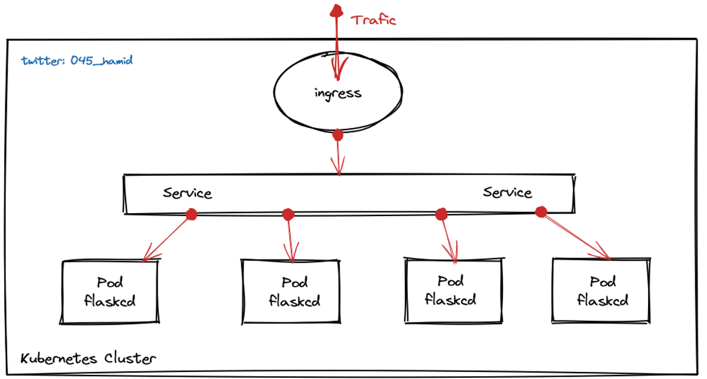
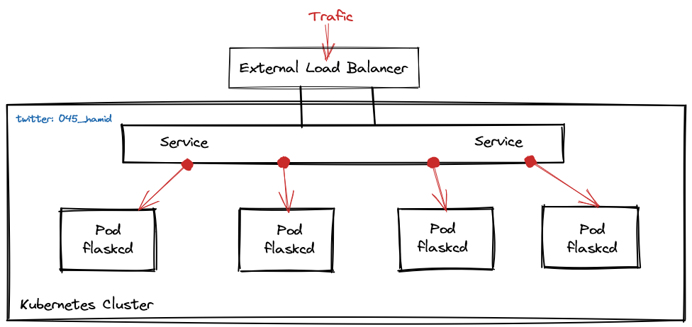

# Simple WEB APP by Flask and Deploy on Kubernetes

This is a web application project which is written by `Flask`.
Also there are some practices regarding creating infrastructure as code (Terraform, Ansible, Vagrant)
and installing kubernetes cluster (via ansible-playbook) and preparing CI/CD pipline for deploying the application on k8s cluster.

### Docker Image
```
docker build -t flaskcd:latest .
```
Also prepared docker image is accessed.
```
docker pull hamidgholami/flaskcd:latest
```
Create a container from the image.
```
docker run --rm --name my-flask -d -p 8080:8080 flaskcd
```

Now visit http://localhost:8080

### Verify the running container
Verify by checking the container `IP` and `hostname` (ID):
```
docker inspect -f '{{range .NetworkSettings.Networks}}{{.IPAddress}}{{end}}' my-flask
docker inspect -f '{{ .Config.Hostname }}' my-flask
```
### Terraform

```
terraform destroy -var-file=dev.tfvars
```

```
terraform plan -var-file=dev.tfvars -out devtfplan.out
#
terraform apply "devtfplan.out"
```
### Ansible
First change the IPs in `inventory` file.
```ini
[machine]
master ansible_host=192.168.11.X
worker-1 ansible_host=192.168.11.X
worker-2 ansible_host=192.168.11.X
[kuberlab]
master
worker-1
worker-2
```
Afterwards run `ansible-playbook`
```sh
ansible-playbook -i provisioning/inventory site.yml
```
### Deploy on Kubernetes
```sh
kubectl apply -k kubernetes/
```
### Load Balancing
For aiming to this we can use 2 kinds of architecture.
1. **Scenario One** We can use Kubernetes `ingress` and `service` for loadbalancing traffics on `Pod`s.
<p align="center">
  
</p>

2. **Scenario Two** We can use an external loadbalancer such as: `HAProxy`, `AWS ALB`, `NGINX` or any other tools and loadbalancing traffics on `Pod`s.
<p align="center">
  
</p>

***
### TO DO
<details> 
<summary> Preview</summary>

- [ ] Adding DB (`MySQL`) and connecting the application to it and adding some forms in application.
- [ ] Creating a `StatefulSet` for `MySQL` for deploying it on Kubernetes.
    - [ ] Configure clustring for `MySQL` in Kubernetes.
- [ ] Implementing `ROOK` or `longhorn` as a `StorageClass` in Kubernetes.
- [ ] Configuring `provision` in `Terraform` for using `ansible-playbook` for installing Kubernetes.
- [ ] Creating `helm` chart for DB and APP.
- [ ] Adding `Sign Up` in WEB APP through either `AWS Cognito` or internally.

</details>